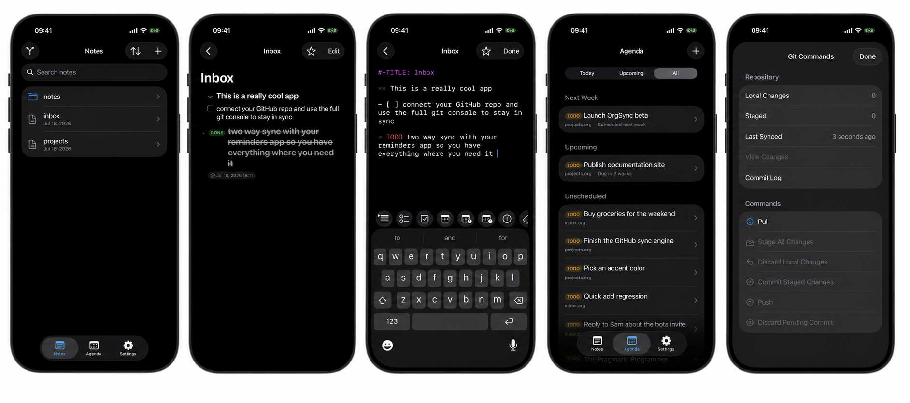

#+TITLE: OrgSync

OrgSync is a native, local-first iOS app for writing and organizing =.org=
files. It includes an org-mode reader and editor, Agenda views with
natural-language quick add, Home Screen widgets, two-way Reminders and
read-only Calendar integration, Siri and Shortcuts support, and optional
GitHub synchronization.

* Free and Pro

OrgSync is freemium. Writing and organizing notes, the agenda, search,
favorites, Siri and Shortcuts, and iCloud Drive syncing are free forever. An
*OrgSync Pro* subscription unlocks four features:

- GitHub repository sync,
- Home Screen widgets,
- two-way Reminders and read-only Calendar sync,
- local notifications for scheduled and deadline TODOs.

Subscriptions are handled by [[https://www.revenuecat.com/][RevenueCat]] and
require *no account*: the only identifier attached to a purchase is a random,
anonymous RevenueCat ID — never a name, email, or note content.

Without Pro you can still sync notes across devices for free: enable *Store
Notes in iCloud Drive* in Settings and your notes folder lives in the app's
iCloud Drive directory, which Apple keeps in sync across your devices.

* Privacy first

OrgSync does not collect, track, analyze, or sell any data. There is no
analytics SDK, telemetry, account system, advertising, or OrgSync-operated
server. The optional Pro subscription is anonymous: RevenueCat processes the
purchase against a random ID with no personal information attached.

All app data lives on your device:

- Notes are stored in the app's local Documents directory — or, if you enable
  it in Settings, in the app's iCloud Drive folder so Apple syncs them across
  your devices.
- Preferences and widget snapshots are stored locally in the app's App Group
  container.
- Your GitHub Personal Access Token is stored in the device Keychain.
- The app does not send data anywhere unless you explicitly enable an optional
  integration.

Optional integrations follow your choices:

- Connecting a GitHub repository sends and receives note content directly with
  GitHub for that repository.
- Enabling Reminders sync reads and writes the Reminders list you choose through
  Apple's EventKit APIs.
- Enabling Calendar sync reads events from the calendars you choose through
  Apple's EventKit APIs and mirrors them into a local, read-only =calendar.org=
  file.

* Features

- Local =.org= file browser with folders, search, favorites, and recent notes.
- Rendered org documents and a syntax-aware plain-text editor.
- Headlines, TODO states, priorities, tags, timestamps, checkboxes, tables,
  links, source blocks, drawers, inline formatting, and more.
- Backlinks (Linked References) surfaced between notes.
- Agenda tab with Today, Upcoming, and All views grouped into time buckets.
- Natural-language quick add that parses a single line such as
  ="call Sam tomorrow 3pm #work !!"= into a scheduled, tagged, prioritized TODO.
- Home Screen widgets for favorites and a configurable, day-grouped agenda with
  tap-to-complete, priority marks, tags, and an add button.
- Siri and Shortcuts App Intents (add, complete, today, upcoming, sync, open
  agenda) plus Apple Intelligence assistant schemas for notes.
- Optional GitHub sync via a fine-grained Personal Access Token: a Git command
  palette to pull, stage, commit, and push, three-way merge with conflict
  resolution, discard of a pending commit, sync status, and commit history.
- Optional two-way sync with a dedicated Apple Reminders list.
- Optional read-only Calendar sync that mirrors events into =calendar.org=.
- Configurable TODO keywords and colors, agenda range, appearance, and
  automatic sync.

* Requirements

- macOS with Xcode and an iOS 26 SDK.
- iOS 26.0 or later for the app, widgets, and tests.
- [[https://just.systems/][just]] is optional but recommended for the development
  commands below.

* Getting started

1. Open =OrgSync.xcodeproj= in Xcode.
2. Choose the =OrgSync= scheme and an iOS 26 simulator or device.
3. Build and run the app.
4. To sync an existing org repository, open *Settings*, enter its GitHub URL,
   provide a fine-grained Personal Access Token with repository access, and
   choose a branch.

The app creates a few sample notes on first launch. They remain local unless
you choose to connect and sync a repository.

* Development

#+begin_src sh
just build
just run
just test
#+end_src

=just run= uses the configured simulator ID. Override it when needed:

#+begin_src sh
IOS_SIMULATOR_ID="YOUR-SIMULATOR-UUID" just run
#+end_src

The full test suite can also be run from Xcode.

** Live GitHub integration test

The regular Git tests use an in-memory GitHub server, so they are fast and
repeatable while covering clone, pull, commit, push, merge conflicts, diffs,
and recovery. There is also an opt-in smoke test for a real GitHub repository;
it validates authentication, repository discovery, clone, and pull without
writing to the remote branch.

1. Create a disposable repository for testing.
2. Create a fine-grained GitHub PAT restricted to that one repository, with
   *Contents: Read and write* permission. Use a short expiry.
3. Copy the template and fill in your local credentials:

   #+begin_src sh
   cp .env.example .env
   #+end_src

   #+begin_src dotenv
   ORGSYNC_REVIEW_REPO_URL=https://github.com/OWNER/REPOSITORY
   ORGSYNC_REVIEW_PAT=github_pat_your_disposable_token
   ORGSYNC_REVIEW_BRANCH=main
   #+end_src

4. Run the opt-in test:

   #+begin_src sh
   just test-live-git
   #+end_src

The live test creates a temporary local working copy and never pushes or
otherwise changes the remote repository.

* Archives and build numbers

The shared =OrgSync= scheme runs =Scripts/increment_build_number.sh= as an
Archive pre-action. Every archive increments all =CURRENT_PROJECT_VERSION=
values in the Xcode project together. Builds, runs, and tests do not change the
build number.

* Privacy and Terms

- [[PRIVACY.org][Privacy Policy]]
- [[TERMS.org][Terms of Use]]

* License

OrgSync is released under the [[LICENSE][MIT License]].
